# 日语学习（日本語勉強）ER 图　中文版

> 本文档是 `日本語勉強設計.md`（日文版）的中文配套资料。
> **图的来源是实库**：2026-09-22 从 `study21`（PostgreSQL 192.168.0.100:54320）的
> `information_schema` / `pg_catalog` 导出全部列、主键、外键、唯一索引、普通索引与 CHECK 约束后绘制，
> 不是照抄 DDL 文件，因此反映的是**库里的真实结构**。

| 项目 | 内容 |
|---|---|
| 对象库 | `study21`（模式 `public`） |
| 日语学习相关表 | **24 张**（`JPN_` 前缀。业务 13 ＋ 详情的版本化新增 11 张段落子表） |
| 外部关联表 | 3 张（`ACC_アカウント`、`BAT_バッチ実行履歴情報`、`BAT_AI呼出履歴情報`） |
| 主键 | 24 个（每表 1 个；`学習状況情報`・`技能習得情報`・`学習日次情報` 是复合主键） |
| 外键 | **75 个**（`ACC_アカウント` 参照与 `JPN_*` 内部参照。2026-09-22 实测） |
| CHECK 约束 | **92 个**（2026-09-22 实测） |
| NOT NULL 约束 | **251 个**（2026-09-22 实测） |
| 唯一索引 | **40 个**（其中 24 个由主键自动生成，16 个是业务唯一键。详情新增 `uq_jpn_detail_version`・`uq_jpn_detail_active`；旧 `uq_jpn_detail_word`・`uq_jpn_detail_old_id` 随旧表 `DROP` 消失） |
| 普通索引 | **37 个**（详情新增 12 个：`idx_jpn_detail_word_state` ＋ 11 张子表各一个 `idx_jpn_detail_*_version`；旧 GIN `idx_jpn_detail_json` 随旧表消失） |
| 视图 | 1 个（`v_jpn_word_ai_state`） |

> **注意（重要）**：详情相关的表（版本头 ＋ 11 子表）与 `JPN_単語問題情報`・`選択肢情報`・`テスト出題情報` 现在都是 **0 行**。
> 「行数」列里的 0 表示「AI 尚未执行、画面尚未作答」，不是「表不存在」。
>
> **图的规模**：Mermaid 图里有 **27 个实体**（业务表 24 ＋ 外部表 3）、**50 条关系**、**224 个属性**。
> **视图 `v_jpn_word_ai_state` 不在图里**（它没有外键，也不参与关系，只是 `JPN_AI生成履歴情報` 的一层投影）。
> 为免图过大，每个实体只画**键与业务关键列**，完整列定义见 `日本語勉強設計_中文.md` 第 5 章（5.4〜5.4.12）。

---

## 1. 读图约定

### 1.1 实体代号与真实表名

Mermaid 的实体名与属性名只能用 ASCII（否则部分渲染器会报错），因此图里用代号，
**每个属性的注释里写着真实的日文列名**。对照表如下。

| 图里的代号 | 真实表名 | 中文含义 | 大致行数（现状） |
|---|---|---|---:|
| `BOOK` | `JPN_書籍情報` | 教材（单词书）主数据 | 1 |
| `WORD` | `JPN_単語情報` | 单词主表 | 345 |
| `COLLECTION` | `JPN_単語収録情報` | 单词的教材收录位置 | 345 |
| `DETAIL` | `JPN_単語詳細情報` | **详情的版本头**（1 行 = 该词的 1 版。每词只有 1 版 `ACTIVE`） | 0 |
| `D_SENSE` | `JPN_単語詳細_語義情報` | 段落的行：语义词 | 0 |
| `D_EXAMPLE` | `JPN_単語詳細_例文情報` | 段落的行：例句 | 0 |
| `D_PATTERN` | `JPN_単語詳細_文型情報` | 段落的行：文型 | 0 |
| `D_DIALOG` | `JPN_単語詳細_会話情報` | 段落的行：会话（父层） | 0 |
| `D_DIALOG_LINE` | `JPN_単語詳細_会話行情報` | 段落的行：会话的 1 句发言 | 0 |
| `D_SYNONYM` | `JPN_単語詳細_類義語情報` | 段落的行：类义语 | 0 |
| `D_CAUTION` | `JPN_単語詳細_注意情報` | 段落的行：易错点（cautions） | 0 |
| `D_COLLOCATION` | `JPN_単語詳細_コロケーション情報` | 段落的行：常用搭配 | 0 |
| `D_RELATED` | `JPN_単語詳細_関連語情報` | 段落的行：关联词 | 0 |
| `D_USAGE` | `JPN_単語詳細_使用場面情報` | 段落的行：使用场面・语感（usageNotes） | 0 |
| `D_PRACTICE` | `JPN_単語詳細_練習情報` | 段落的行：迷你练习 | 0 |
| `QUESTION` | `JPN_単語問題情報` | AI 生成的题目 | 0 |
| `CHOICE` | `JPN_単語問題選択肢情報` | **选项池**（1 题 5〜7 件：正解 1 ＋ 误答 4〜6）。不是「4 択」 | 0 |
| `TEST` | `JPN_テスト情報` | 一次测试 | 15 |
| `TEST_ENTRY` | `JPN_テスト出題情報` | 测试中的一道题（= 一个词）＋本次提示的选项 | 0 |
| `STATUS` | `JPN_学習状況情報` | 按「用户 × 词」的学习状况 | 0 |
| `SKILL` | `JPN_技能習得情報` | 按「用户 × 词 × 题型技能」的掌握度 | 0 |
| `DAILY` | `JPN_学習日次情報` | 按「用户 × 日期」的汇总 | 13 |
| `AI_GEN` | `JPN_AI生成履歴情報` | AI 生成任务的执行记录 | 0 |
| `AUDIO` | `JPN_音声キャッシュ情報` | 朗读语音缓存 | 0 |
| `AI_STATE` | `v_jpn_word_ai_state`（**视图**） | AI 生成状态的最新一行 ＋ 是否曾经成功（一览「取得状态」列用） | 派生 |
| `ACCOUNT` | `ACC_アカウント` | 账号（外部表，只画主键） | 5 |
| `CALL_LOG` | `BAT_AI呼出履歴情報` | AI 调用日志（外部表，**无外键**） | — |
| `BATCH_RUN` | `BAT_バッチ実行履歴情報` | 批处理执行历史（外部表，**无外键**） | — |

### 1.2 关系记号

| 记号 | 含义 |
|---|---|
| `\|\|--o{` | 一对多（实线 = 有外键约束） |
| `\|\|--\|\|` / `\|\|--o\|` | 一对一 / 一对零或一 |
| `}o..o\|` | 逻辑引用（**图上画了，但库里没有外键**） |
| `PK` / `FK` / `UK` | 主键 / 外键 / 唯一键 |

---

## 2. ER 图（Mermaid）

> 图中每个实体只画**键与业务关键列**；完整列定义见 `日本語勉強設計_中文.md` 第 5 章。
> 列名前的日文原词写在注释里（例：`"単語ID 主键"`）。

```mermaid
erDiagram
    ACCOUNT ||--o{ WORD : "登记・修改（审计列）"
    ACCOUNT ||--o{ COLLECTION : "登记・修改（审计列）"
    ACCOUNT ||--o{ DETAIL : "登记・修改（审计列）"
    ACCOUNT ||--o{ D_SENSE : "登记・修改（审计列）"
    ACCOUNT ||--o{ D_EXAMPLE : "登记・修改（审计列）"
    ACCOUNT ||--o{ D_PATTERN : "登记・修改（审计列）"
    ACCOUNT ||--o{ D_DIALOG : "登记・修改（审计列）"
    ACCOUNT ||--o{ D_DIALOG_LINE : "登记・修改（审计列）"
    ACCOUNT ||--o{ D_SYNONYM : "登记・修改（审计列）"
    ACCOUNT ||--o{ D_CAUTION : "登记・修改（审计列）"
    ACCOUNT ||--o{ D_COLLOCATION : "登记・修改（审计列）"
    ACCOUNT ||--o{ D_RELATED : "登记・修改（审计列）"
    ACCOUNT ||--o{ D_USAGE : "登记・修改（审计列）"
    ACCOUNT ||--o{ D_PRACTICE : "登记・修改（审计列）"
    ACCOUNT ||--o{ QUESTION : "登记・修改（审计列）"
    ACCOUNT ||--o{ TEST : "考生（利用者）"
    ACCOUNT ||--o{ TEST_ENTRY : "登记・修改（审计列）"
    ACCOUNT ||--o{ STATUS : "学习状况的持有者"
    ACCOUNT ||--o{ SKILL : "技能掌握的持有者"
    ACCOUNT ||--o{ DAILY : "日次汇总的持有者"
    ACCOUNT ||--o{ BOOK : "登记・修改（审计列）"
    ACCOUNT ||--o{ AI_GEN : "登记・修改（审计列）"
    ACCOUNT ||--o{ AUDIO : "生成・最后使用"

    BOOK ||--o{ COLLECTION : "收录到（書籍ID・RESTRICT）"
    WORD ||--o{ COLLECTION : "被收录（CASCADE）"
    WORD ||--o{ DETAIL : "详情的版本头 1 词 N 版（CASCADE）"
    DETAIL ||--o{ D_SENSE : "段落的行（CASCADE）"
    DETAIL ||--o{ D_EXAMPLE : "段落的行（CASCADE）"
    DETAIL ||--o{ D_PATTERN : "段落的行（CASCADE）"
    DETAIL ||--o{ D_DIALOG : "段落的行（CASCADE）"
    DETAIL ||--o{ D_SYNONYM : "段落的行（CASCADE）"
    DETAIL ||--o{ D_CAUTION : "段落的行（CASCADE）"
    DETAIL ||--o{ D_COLLOCATION : "段落的行（CASCADE）"
    DETAIL ||--o{ D_RELATED : "段落的行（CASCADE）"
    DETAIL ||--o{ D_USAGE : "段落的行（CASCADE）"
    DETAIL ||--o{ D_PRACTICE : "段落的行（CASCADE）"
    D_DIALOG ||--o{ D_DIALOG_LINE : "1 句发言（CASCADE・会話ID）"
    DETAIL }o..o| DETAIL : "元詳細ID（无外键・版本链）"
    WORD ||--o{ QUESTION : "题目（CASCADE）"
    QUESTION ||--o{ CHOICE : "选项池 5〜7 件（CASCADE・UNIQUE 问题×显示顺序）"
    WORD ||--o{ TEST_ENTRY : "被出题（CASCADE）"
    TEST ||--o{ TEST_ENTRY : "出题（CASCADE・UNIQUE 测试×出题顺序）"
    WORD ||--o{ STATUS : "学习状况（CASCADE）"
    WORD ||--o{ SKILL : "技能掌握（CASCADE）"
    WORD ||--o{ AI_GEN : "AI 生成记录（CASCADE）"

    TEST_ENTRY }o..o| QUESTION : "問題ID（无外键・只用于生成的测试）"
    TEST_ENTRY }o..o| COLLECTION : "収録ID（无外键・仅记录出题来源）"
    DETAIL }o..o| AI_GEN : "生成ID（无外键・指向 JPN_AI生成履歴情報）"
    AI_GEN }o..o| CALL_LOG : "呼出履歴ID（无外键・日志有保留期）"
    AI_GEN }o..o| BATCH_RUN : "执行 ID（无外键・执行历史由批处理侧持有）"

    BOOK {
        bigint book_id PK "書籍ID 主键"
        varchar book_code UK "書籍コード 教材编号（如 01）"
        varchar book_name "書籍名 教材名（与収録.書籍 同值）"
        int category_count "分類数 单元数（缓存列）"
        int word_count "収録語数 收录词数（缓存列）"
        varchar state_code "状態コード ACTIVE/INACTIVE"
    }

    WORD {
        bigint word_id PK "単語ID 主键"
        varchar heading "見出し語 词条表记"
        varchar heading_key "見出し語キー 检索键（NFKC・空白归一）"
        varchar reading "読み 读音（可为 NULL＝尚未取得）"
        varchar reading_key "読みキー 读音键（NOT NULL・未取得时为空串）"
        varchar jlpt "JLPTレベル 目前全为 NULL"
        varchar part_of_speech "品詞 词性（[名] 这类日文标记）"
        varchar state_code "状態コード ACTIVE/INACTIVE"
        int version "バージョン 乐观锁"
    }

    COLLECTION {
        bigint collection_id PK "収録ID 主键"
        bigint word_id FK "単語ID 单词"
        bigint book_id FK "書籍ID 教材（可为 NULL）"
        varchar book "書籍 教材名（冗余的名称列）"
        varchar category "分類 单元（Unit001 形式）"
        int word_seq "単語SEQ 单元内顺序"
        varchar level "レベル 教材等级带（现状全为 N1-N5）"
        varchar state_code "状態コード ACTIVE/INACTIVE"
    }

    DETAIL {
        bigint detail_id PK "詳細ID 主键"
        bigint word_id FK "単語ID 单词（1 词 N 版・部分 UNIQUE 保证只有 1 版 ACTIVE）"
        int content_version "内容版数 该词内的版本号（UNIQUE 単語×版数）"
        varchar state_code "状態コード ACTIVE=生效版 / ARCHIVED=历史"
        bigint origin_detail_id "元詳細ID 基于哪一版（无外键・自表引用）"
        bigint generation_id "生成ID 哪次 AI 生成（人工版为 NULL・无外键）"
        varchar ai_provider "AIプロバイダ 产生这一版的 AI"
        varchar ai_model "AIモデル"
        timestamp fetched_at "取得日時 产生这一版的时间"
        boolean manual_corrected "手修正フラグ 这一版含人工编辑"
        text core_meaning "核心意味 词级：核心意义"
        varchar jlpt "JLPTレベル 词级（版本头里的值）"
        varchar part_of_speech "品詞"
        smallint importance "重要度 1〜5"
        jsonb pronunciation_json "発音JSON 发音（单数对象）"
        jsonb conjugations_json "活用形JSON 活用形数组"
        jsonb transitivity_pair_json "自他対応JSON 自他对应（无则 NULL）"
        jsonb raw_response_json "元レスポンスJSON AI 原始响应（组装后是 structured）"
        int version "バージョン 乐观锁"
    }

    D_SENSE {
        bigint sense_id PK "語義ID 主键"
        bigint detail_id FK "詳細ID 版本头（CASCADE）"
        int order_no "表示順 1 起（无 (詳細ID,表示順) 唯一约束）"
        smallint sense_number "語義番号 例句・使用场面按它关联"
        text japanese "日本語 语义词说明（非空）"
        text chinese "中国語"
        boolean manual_corrected "手修正フラグ 人工编辑过"
        varchar source_code "登録元コード BATCH=AI / APP=人"
    }

    D_EXAMPLE {
        bigint example_id PK "例文ID 主键"
        bigint detail_id FK "詳細ID 版本头（CASCADE）"
        int order_no "表示順"
        text japanese "例文_日本語（非空）"
        text reading "例文読み"
        text chinese "例文_中国語"
        smallint sense_number "語義番号（NULL=全部语义词）"
        varchar level "レベル BASIC / APPLIED"
        varchar source_code "登録元コード BATCH / APP"
    }

    D_PATTERN {
        bigint pattern_id PK "文型ID 主键"
        bigint detail_id FK "詳細ID 版本头（CASCADE）"
        int order_no "表示順"
        varchar pattern "文型 型（非空）"
        varchar reading "文型読み"
        text chinese "説明_中国語"
        varchar source_code "登録元コード BATCH / APP"
    }

    D_DIALOG {
        bigint dialog_id PK "会話ID 主键"
        bigint detail_id FK "詳細ID 版本头（CASCADE）"
        int order_no "表示順"
        text scene "場面 会话场景"
        varchar source_code "登録元コード BATCH / APP"
    }

    D_DIALOG_LINE {
        bigint dialog_line_id PK "会話行ID 主键"
        bigint dialog_id FK "会話ID 会话（CASCADE・注意：没有 詳細ID 列）"
        int order_no "表示順"
        varchar speaker "話者"
        text japanese "日本語 发言（非空）"
        text chinese "中国語"
        varchar source_code "登録元コード BATCH / APP"
    }

    D_SYNONYM {
        bigint synonym_id PK "類義語ID 主键"
        bigint detail_id FK "詳細ID 版本头（CASCADE）"
        int order_no "表示順"
        varchar heading "見出し語 比较的词（非空）"
        varchar reading "読み"
        text shared "共通点"
        text difference "違い"
        varchar source_code "登録元コード BATCH / APP"
    }

    D_CAUTION {
        bigint caution_id PK "注意ID 主键"
        bigint detail_id FK "詳細ID 版本头（CASCADE）"
        int order_no "表示順"
        varchar kind "区分 GRAMMAR / UNNATURAL / MEANING / PARTICLE"
        varchar title "見出し"
        text wrong "誤り 错例"
        text correct "正しい 正确说法"
        varchar source_code "登録元コード BATCH / APP"
    }

    D_COLLOCATION {
        bigint collocation_id PK "コロケーションID 主键"
        bigint detail_id FK "詳細ID 版本头（CASCADE）"
        int order_no "表示順"
        varchar expression "表現 搭配（非空）"
        varchar reading "読み"
        text usage "使い方"
        varchar source_code "登録元コード BATCH / APP"
    }

    D_RELATED {
        bigint related_id PK "関連語ID 主键"
        bigint detail_id FK "詳細ID 版本头（CASCADE）"
        int order_no "表示順"
        varchar relation "関係 類義語 / 対義語 / 間違えやすい / 同じ読み（日文值）"
        varchar heading "見出し語 关联的词（非空）"
        varchar source_code "登録元コード BATCH / APP"
    }

    D_USAGE {
        bigint usage_note_id PK "使用場面ID 主键"
        bigint detail_id FK "詳細ID 版本头（CASCADE）"
        int order_no "表示順"
        smallint sense_number "語義番号（NULL=整个词）"
        varchar register "文体区分 口语 / 书面语"
        varchar politeness "丁寧さ"
        varchar audience "対象"
        varchar source_code "登録元コード BATCH / APP"
    }

    D_PRACTICE {
        bigint practice_id PK "練習ID 主键"
        bigint detail_id FK "詳細ID 版本头（CASCADE）"
        int order_no "表示順"
        varchar kind "種別 PARTICLE / SYNONYM / SCENE / WRITING"
        text question "問題_日本語（非空）"
        jsonb choices_json "選択肢JSON 字符串数组（CHECK 为 array）"
        boolean free_writing "自由記述フラグ"
        varchar source_code "登録元コード BATCH / APP"
    }

    QUESTION {
        bigint question_id PK "問題ID 主键"
        bigint word_id FK "単語ID 单词"
        varchar question_type "問題種別 C1_READING/C2_KANJI/D_CONTEXT_MEANING/E_KANJI_USAGE"
        smallint question_no "問題番号 同类型内的序号"
        varchar target_heading "対象表記"
        varchar target_reading "対象読み"
        text correct_value "正解値 正确答案"
        varchar state_code "状態コード GENERATED/ACTIVE/REJECTED/ARCHIVED"
        int content_version "内容版数"
        jsonb structured_json "構造化JSON 原始 DTO（便于事后核对）"
    }

    CHOICE {
        bigint choice_id PK "選択肢ID 主键"
        bigint question_id FK "問題ID 题目"
        int order_no "表示順 1 起（池里 5〜7 件・不是 1〜4）"
        varchar value "選択肢値"
        varchar reading "選択肢読み"
        boolean correct "正解フラグ 池里恰好 1 行为 true"
        varchar wrong_type "誤答区分 错因（正解行为 NULL）"
    }

    TEST {
        bigint test_id PK "テストID 主键"
        varchar test_no UK "テスト番号 对人显示的编号"
        bigint account_id FK "利用者アカウントID 考生"
        char test_type "テスト種別 A/B/C/D/E"
        varchar book "書籍 出题范围（教材）"
        varchar category_from "分類開始 起始单元"
        varchar category_to "分類終了 结束单元"
        int question_count "出題数"
        int done_count "完了出題数"
        int correct_count "正解数"
        int wrong_count "不正解数"
        varchar state_code "状態コード CREATED/RUNNING/COMPLETED"
        int version "バージョン 乐观锁"
    }

    TEST_ENTRY {
        bigint entry_id PK "出題ID 主键"
        bigint test_id FK "テストID 测试"
        bigint word_id FK "単語ID 单词"
        bigint collection_id "収録ID 出题来源（无外键）"
        int order_no "出題順 UNIQUE(测试×顺序)"
        bigint question_id "問題ID 所用题目（无外键）"
        varchar entry_state "出題状態 PENDING/ANSWERED/SKIPPED"
        varchar judgment "最終判定"
        int answer_count "回答回数"
        int wrong_count "誤答回数"
        jsonb snapshot_json "単語スナップショットJSON 出题时的快照"
        jsonb choices_json "出題選択肢JSON 本次提示的 4 件（已打乱・CHECK 为 array）"
        jsonb answer_history_json "回答履歴JSON 每次作答的记录数组"
    }

    STATUS {
        bigint account_id PK,FK "利用者アカウントID 复合主键"
        bigint word_id PK,FK "単語ID 复合主键"
        varchar learn_state "学習状態 NOT_STARTED/LEARNING/REVIEW/MASTERED"
        numeric mastery "総合習得度 0〜100（技能平均的缓存值）"
        boolean favorite "お気に入りフラグ"
        int answer_count "回答回数"
        int correct_count "正解回数"
        int wrong_count "不正解回数"
        int streak "連続正解回数"
        timestamp last_studied_at "最終学習日時"
        timestamp next_review_at "次回復習日時（现状全为 NULL）"
    }

    SKILL {
        bigint account_id PK,FK "利用者アカウントID 复合主键"
        bigint word_id PK,FK "単語ID 复合主键"
        char test_type PK "テスト種別 与技能一一对应"
        varchar skill_code PK "技能区分 如 C_READING_RECOGNITION"
        varchar learn_state "学習状態"
        numeric mastery "習得度 0〜100"
        int answer_count "回答回数"
        timestamp last_studied_at "最終学習日時"
    }

    DAILY {
        bigint account_id PK,FK "利用者アカウントID 复合主键"
        date study_date PK "学習日 学习日期"
        bigint active_ms "有効学習時間ms 有效学习毫秒"
        bigint a_ms "A学習時間ms"
        bigint b_ms "B学習時間ms"
        bigint c_ms "C学習時間ms"
        bigint d_ms "D学習時間ms"
        bigint e_ms "E学習時間ms"
        int word_count "学習単語数"
        int completed_tests "完了テスト数"
        int completed_tasks "完了課題数（沿用 2.0 的「课题」口径）"
        int correct_tasks "正解課題数"
        int wrong_tasks "不正解課題数"
    }

    AI_GEN {
        bigint generation_id PK "生成ID 主键"
        bigint word_id FK "単語ID 单词"
        varchar content_type "内容種別コード A_DETAIL/C1_READING/C2_KANJI/D_CONTEXT_MEANING/E_KANJI_USAGE"
        varchar state_code "状態コード QUEUED/RUNNING/SUCCEEDED/FAILED/CANCELED"
        int content_version "内容版数"
        bigint call_log_id "呼出履歴ID（无外键）"
        int generated_count "生成件数"
        int failed_count "失敗件数"
        varchar error_code "エラーコード"
        timestamp started_at "開始日時"
        timestamp finished_at "終了日時"
    }

    AUDIO {
        bigint audio_id PK "音声ID 主键"
        char audio_key UK "音声キー 文本＋话者＋速度 的 SHA-256(64 位)"
        text audio_text "テキスト 朗读文本（缓存键的一部分）"
        varchar speaker "話者"
        numeric speed "速度 0.5〜2.0"
        varchar source_code "音声ソースコード TTS/UPLOAD"
        varchar state_code "状態コード READY/FAILED/EXPIRED"
        varchar storage_path "音声保存先パス 相对路径"
        int external_calls "外部呼出回数 外部 TTS 调用次数"
        int play_count "再生回数"
        varchar target_type "対象種別コード 首次生成的来源（不是键）"
        bigint target_id "対象ID 首次生成的来源 ID（不是键）"
    }

    ACCOUNT {
        bigint account_id PK "アカウントID 账号"
    }

    CALL_LOG {
        bigint call_log_id PK "呼出履歴ID AI 调用日志"
    }

    BATCH_RUN {
        bigint execution_id PK "実行ID 批处理执行"
    }
```



---

## 3. 文字版关系图（不依赖渲染器）

```
                        ┌───────────────────────────┐
                        │ ACC_アカウント             │  外部表（PK アカウントID）
                        └─────────────┬─────────────┘
        利用者・登録者・更新者（审计列）│  大多数表都指向它
   ┌────────────────┬───────────────┼────────────────┬────────────────┐
   ▼                ▼               ▼                ▼                ▼
JPN_テスト情報  JPN_学習状況情報  JPN_技能習得情報  JPN_学習日次情報  JPN_音声キャッシュ情報
   │ 1              ▲ 1               ▲ 1              ▲ 1              （独立。键＝文本＋话者＋速度）
   │                │                 │                │
   │ N              │ (利用者×単語)    │ (＋题型技能)     │ (利用者×日付)
JPN_テスト出題情報   │                 │                │
   │  │  │          │                 │                │
   │  │  └─参照──▶ JPN_単語問題情報 ──1:N──▶ JPN_単語問題選択肢情報
   │  │            （問題ID 无外键）      （选项池。1 題 5〜7 件、正解 1 行）
   │  │                                    ↑
   │  │             作成测试时从池抽「正解 1 ＋ 误答 3」→ 打乱 → 固定在
   │  │             JPN_テスト出題情報.出題選択肢JSON（画面上只看这 4 件）
   │  │
   │  └─参照──▶ JPN_単語収録情報 ──N:1──▶ JPN_書籍情報
   │            （収録ID 无外键）  ▲
   │                              │ 1:N（CASCADE）
   └──N:1──▶ JPN_単語情報 ─────────┘
              │ 1
              ├──1:N（CASCADE）─▶ JPN_単語詳細情報   ← **版本头**。1 行 = 该词的 1 版
              │                      │  ├─ 状態コード='ACTIVE' 的 1 行 = 生效版（部分唯一索引）
              │                      │  └─ 1:N（CASCADE）─▶ 11 张段落子表
              │                      │       語義 / 例文 / 文型 / 会話 ─1:N─▶ 会話行
              │                      │       / 類義語 / 注意 / コロケーション
              │                      │       / 関連語 / 使用場面 / 練習
              │                      └─(无外键)─▶ 元詳細ID（自表・版本链）
              │                      └─(无外键)─▶ JPN_AI生成履歴情報.生成ID
              ├──1:N（CASCADE）─▶ JPN_単語問題情報 ──▶ JPN_単語問題選択肢情報
              ├──1:N（CASCADE）─▶ JPN_学習状況情報
              ├──1:N（CASCADE）─▶ JPN_技能習得情報（**A 类不写这行**）
              ├──1:N（CASCADE）─▶ JPN_AI生成履歴情報 ──(无外键)──▶ BAT_AI呼出履歴情報
              └──1:N（CASCADE）─▶ JPN_テスト出題情報
```

---

## 4. 关系清单（外键的真实定义）

| # | 父表 | 子表 | 子表列 | 可空 | 删除规则 | 含义 |
|---:|---|---|---|---|---|---|
| 1 | `JPN_単語情報` | `JPN_単語収録情報` | `単語ID` | NOT NULL | CASCADE | 词删掉则收录一起消失 |
| 2 | `JPN_書籍情報` | `JPN_単語収録情報` | `書籍ID` | **NULL 允许** | RESTRICT | 教材被收录引用时不能删（见评审 A1） |
| 3 | `JPN_単語情報` | `JPN_単語詳細情報` | `単語ID` | NOT NULL | CASCADE | **1 词 N 版（版本头）**。删词则全部版本与段落行一起消失 |
| 4 | `JPN_単語詳細情報` | `JPN_単語詳細_語義情報` | `詳細ID` | NOT NULL | CASCADE | 段落行跟随版本。版本被归档时行留在原版下（不迁移） |
| 5 | `JPN_単語詳細情報` | `JPN_単語詳細_例文情報` | `詳細ID` | NOT NULL | CASCADE | 同上 |
| 6 | `JPN_単語詳細情報` | `JPN_単語詳細_文型情報` | `詳細ID` | NOT NULL | CASCADE | 同上 |
| 7 | `JPN_単語詳細情報` | `JPN_単語詳細_会話情報` | `詳細ID` | NOT NULL | CASCADE | 同上（会话父层） |
| 8 | `JPN_単語詳細_会話情報` | `JPN_単語詳細_会話行情報` | `会話ID` | NOT NULL | CASCADE | **会話行挂的是会話，不是版本头**（会话是两层嵌套） |
| 9 | `JPN_単語詳細情報` | `JPN_単語詳細_類義語情報` | `詳細ID` | NOT NULL | CASCADE | 段落行跟随版本 |
| 10 | `JPN_単語詳細情報` | `JPN_単語詳細_注意情報` | `詳細ID` | NOT NULL | CASCADE | 同上 |
| 11 | `JPN_単語詳細情報` | `JPN_単語詳細_コロケーション情報` | `詳細ID` | NOT NULL | CASCADE | 同上 |
| 12 | `JPN_単語詳細情報` | `JPN_単語詳細_関連語情報` | `詳細ID` | NOT NULL | CASCADE | 同上 |
| 13 | `JPN_単語詳細情報` | `JPN_単語詳細_使用場面情報` | `詳細ID` | NOT NULL | CASCADE | 同上 |
| 14 | `JPN_単語詳細情報` | `JPN_単語詳細_練習情報` | `詳細ID` | NOT NULL | CASCADE | 同上 |
| 15 | `JPN_単語情報` | `JPN_単語問題情報` | `単語ID` | NOT NULL | CASCADE | 词删掉则题目消失 |
| 16 | `JPN_単語問題情報` | `JPN_単語問題選択肢情報` | `問題ID` | NOT NULL | CASCADE | 题目删掉则**选项池**消失 |
| 17 | `JPN_単語情報` | `JPN_テスト出題情報` | `単語ID` | NOT NULL | CASCADE | 词删掉则出题记录消失 |
| 18 | `JPN_テスト情報` | `JPN_テスト出題情報` | `テストID` | NOT NULL | CASCADE | 测试删掉则出题记录消失 |
| 19 | `JPN_単語情報` | `JPN_学習状況情報` | `単語ID` | NOT NULL | CASCADE | 词删掉则学习状况消失 |
| 20 | `JPN_単語情報` | `JPN_技能習得情報` | `単語ID` | NOT NULL | CASCADE | 同上（**A 类不产生这张表的行**） |
| 21 | `JPN_単語情報` | `JPN_AI生成履歴情報` | `単語ID` | NOT NULL | CASCADE | 同上 |
| 22 | `ACC_アカウント` | 24 张表 | `利用者/登録者/更新者アカウントID` | 多数可空 | RESTRICT | 有引用时不能删账号 |
| 23 | — | `JPN_学習状況情報`（PK） | `利用者アカウントID` + `単語ID` | NOT NULL | — | 复合主键 |
| 24 | — | `JPN_技能習得情報`（PK） | `利用者` + `単語` + `テスト種別` + `技能区分` | NOT NULL | — | 复合主键（4 列） |
| 25 | — | `JPN_学習日次情報`（PK） | `利用者アカウントID` + `学習日` | NOT NULL | — | 复合主键 |

> **版本头与它的段落子表是「一张表 ＋ 11 张表」**，不是「主表 ＋ 明细」：11 张表各自装一种段落，
> 多与少都由内容的形态决定（会话是两层所以拆 2 张；练习的选项是字符串数组所以留在 JSONB 列）。

### 4.1 画了图但没有外键的引用（悬空引用清单）

| 表 | 列 | 指向 | 为什么没有外键 |
|---|---|---|---|
| `JPN_単語詳細情報` | `元詳細ID` | 自表 `JPN_単語詳細情報.詳細ID` | 版本链。历史版被清掉后不能把约束搞坏 |
| `JPN_単語詳細情報` | `生成ID` | `JPN_AI生成履歴情報.生成ID` | 生成履歴有保留期（会被清理） |
| `JPN_テスト出題情報` | `問題ID` | `JPN_単語問題情報.問題ID` | 题目可能被归档/重新生成，出题历史要能留 |
| `JPN_テスト出題情報` | `収録ID` | `JPN_単語収録情報.収録ID` | 教材改版会删收录，出题记录不能跟着消失 |
| `JPN_AI生成履歴情報` | `呼出履歴ID` | `BAT_AI呼出履歴情報.呼出履歴ID` | 调用日志有保留期（会被清理）。**2026-09-22 起这个值真的会被写入**（此前恒为 NULL） |
| `JPN_音声キャッシュ情報` | `対象種別コード` + `対象ID` | 词/题 | 不是缓存键（同一文本可跨词共用） |
| （执行 ID 列） | — | `BAT_バッチ実行履歴情報.実行ID` | 执行历史由批处理侧持有，AI 生成记录只带 ID |
| `JPN_テスト出題情報` | `出題選択肢JSON[].choiceId` | `JPN_単語問題選択肢情報.選択肢ID` | 存在 JSONB 里，DB 无法建 FK。A・B 的 `choiceId` 为 null。自查 SQL 见附录 B-3i |

> 这些列**可以指向已删除的行**。查询时若需要显示，必须用 LEFT JOIN 并容忍空值。
> 自查 SQL 见 `日本語勉強設計_中文.md` 附录 B。

---

## 5. 键与索引总览

### 5.1 唯一键（业务唯一性）

| 表 | 唯一键 | 说明 |
|---|---|---|
| `JPN_単語情報` | `uq_jpn_word_key`（`見出し語キー`,`読みキー`）**部分唯一**：`読みキー` 非空的行 | 读音未取得（空串）时允许同一词条多条 |
| `JPN_単語情報` | `uq_jpn_word_old_id`（`旧単語ID`） | 迁移幂等 |
| `JPN_単語収録情報` | `uq_jpn_collect_old_id`（`旧収録ID`） | 迁移幂等 |
| `JPN_単語収録情報` | `uq_jpn_collect_position`（`書籍ID`,`分類`,`単語SEQ`）**部分唯一**：`状態コード='ACTIVE' AND 書籍ID IS NOT NULL` | 同教材・同单元内的顺序唯一（2026-09-22 追加） |
| `JPN_単語詳細情報` | `uq_jpn_detail_version`（`単語ID`,`内容版数`） | 同一词内版本号唯一（1 起・递增） |
| `JPN_単語詳細情報` | `uq_jpn_detail_active`（`単語ID`）**部分唯一**：`状態コード='ACTIVE'` | **每词恰好 1 版生效**。DB 层保证，切换版本时顺序不能换 |
| `JPN_単語問題情報` | `uq_jpn_question_old_id`（`旧問題ID`） | 迁移幂等 |
| `JPN_単語問題選択肢情報` | `uq_jpn_choice_order`（`問題ID`,`表示順`） | 选项顺序唯一 |
| `JPN_単語問題選択肢情報` | `uq_jpn_choice_old_id`（`旧選択肢ID`） | 迁移幂等 |
| `JPN_テスト情報` | `uq_jpn_test_number`（`テスト番号`） | 对外编号唯一 |
| `JPN_テスト情報` | `uq_jpn_test_old_id`（`旧テストID`） | 迁移幂等 |
| `JPN_テスト出題情報` | `uq_jpn_test_question_order`（`テストID`,`出題順`） | 出题顺序唯一 |
| `JPN_テスト出題情報` | `uq_jpn_test_question_old_id`（`旧出題ID`） | 迁移幂等 |
| `JPN_書籍情報` | `uq_jpn_book_code`（`書籍コード`） | 教材编号唯一 |
| `JPN_書籍情報` | `uq_jpn_book_old_code`（`旧書籍コード`） | 迁移幂等 |
| `JPN_音声キャッシュ情報` | `uq_jpn_audio_key`（`音声キー`） | 同一文本＋话者＋速度只有 1 行 |

> **注意**：`JPN_単語収録情報` 的（`書籍`,`分類`,`単語SEQ`）由**部分唯一索引 `uq_jpn_collect_position`** 保证
> （`状態コード='ACTIVE' AND 書籍ID IS NOT NULL` 的行中唯一。2026-09-22 追加）。
> `INACTIVE` 的历史行可以保留相同位置。
>
> **11 张段落子表没有 `(詳細ID, 表示順)` 的唯一约束**（有意）。画面可以自由重排，`表示順` 由应用重新编号；
> 「同一版里两条完全相同的行」在内容判定时会取第一条（见评审 A6）。

### 5.2 主要检索索引

| 表 | 索引 | 用途 |
|---|---|---|
| `JPN_単語情報` | `idx_jpn_word_reading`（`読みキー`）／`idx_jpn_word_filter`（`JLPTレベル`,`品詞`,`状態コード`） | 读音检索、条件筛选 |
| `JPN_単語収録情報` | `idx_jpn_collect_book`（`書籍`,`分類`,`単語SEQ`）／`idx_jpn_collection_book`（`書籍ID`,`分類`）WHERE `書籍ID` IS NOT NULL ／`idx_jpn_collect_word`（`単語ID`） | 列表排序、按教材取词、按词取收录 |
| `JPN_単語詳細情報` | `idx_jpn_detail_word_state`（`単語ID`,`状態コード`） | 取**生效版**（详细展示・AI 的输入・版本一览）。旧 GIN `idx_jpn_detail_json` 已随旧表消失（评审 B4 自然解决） |
| `JPN_単語詳細_語義情報` | `idx_jpn_detail_sense_version`（`詳細ID`,`表示順`,`語義ID`） | 按版本读段落（排序在 SQL 一处决定） |
| `JPN_単語詳細_例文情報` | `idx_jpn_detail_example_version` | 同上 |
| `JPN_単語詳細_文型情報` | `idx_jpn_detail_pattern_version` | 同上 |
| `JPN_単語詳細_会話情報` | `idx_jpn_detail_dialog_version` | 同上 |
| `JPN_単語詳細_会話行情報` | `idx_jpn_detail_dialog_line_version`（`会話ID`,`表示順`,`会話行ID`） | 按会话读发言（**用 `会話ID`，不是 `詳細ID`**） |
| `JPN_単語詳細_類義語情報` | `idx_jpn_detail_synonym_version` | 同上 |
| `JPN_単語詳細_注意情報` | `idx_jpn_detail_caution_version` | 同上 |
| `JPN_単語詳細_コロケーション情報` | `idx_jpn_detail_collocation_version` | 同上 |
| `JPN_単語詳細_関連語情報` | `idx_jpn_detail_related_version` | 同上 |
| `JPN_単語詳細_使用場面情報` | `idx_jpn_detail_usage_note_version` | 同上 |
| `JPN_単語詳細_練習情報` | `idx_jpn_detail_practice_version` | 同上 |
| `JPN_単語問題情報` | `idx_jpn_question_word`（`単語ID`,`問題種別`）／`idx_jpn_question_type`（`問題種別`,`状態コード`） | 取词的问题、按类型取题 |
| `JPN_テスト情報` | `idx_jpn_test_user`（`利用者`,`登録日時` DESC）／`idx_jpn_test_state`（`利用者`,`状態コード`） | 测试列表 |
| `JPN_テスト出題情報` | GIN `idx_jpn_test_question_history`（`回答履歴JSON`）／`idx_jpn_test_question_word`（`単語ID`） | 逐题作答记录检索。**`出題選択肢JSON` 没有索引**（按出題行整行读，不做 JSONB 检索） |
| `JPN_学習状況情報` | `idx_jpn_status_state`（`利用者`,`学習状態`）／`idx_jpn_status_review`（`利用者`,`次回復習日時`） | 状况列表、复习（SRS 未实现） |
| `JPN_技能習得情報` | `idx_jpn_skill_user`（`利用者`,`技能区分`）／`idx_jpn_skill_review` | 技能列表、复习 |
| `JPN_学習日次情報` | `idx_jpn_daily_user`（`利用者`,`学習日` DESC） | 日次图表 |
| `JPN_AI生成履歴情報` | `idx_jpn_ai_gen_word`（`単語`,`内容種別`,`登録日時` DESC）／部分索引 `idx_jpn_ai_gen_active`（进行中）／`idx_jpn_ai_gen_failed`（失败）／`idx_jpn_ai_gen_call` | 取目标词、防重复执行、失败重跑 |
| `v_jpn_word_ai_state`（视图） | 无（继承 `JPN_AI生成履歴情報` 的索引；`DISTINCT ON` 每页 100 词可接受） | 一览的「取得状态」列 |
| `JPN_音声キャッシュ情報` | `uq_jpn_audio_key`／部分索引 `idx_jpn_audio_unused`（READY 且按最后使用时间）／`idx_jpn_audio_failed`／`idx_jpn_audio_target` | 缓存命中、清理、失败重试 |
| `JPN_書籍情報` | `uq_jpn_book_code`／`idx_jpn_book_order`（`表示順`,`書籍名`）／`idx_jpn_book_state` | 教材下拉、排序 |

---

## 6. 数据现状（2026-09-22 实测）

| 表 | 行数 | 备注 |
|---|---:|---|
| `JPN_書籍情報` | 1 | `01 / N1~N5日本語単語`，分類数 4、収録語数 345 |
| `JPN_単語情報` | 345 | **読み与 JLPT 全为 NULL**（读音等 batC41 回填） |
| `JPN_単語収録情報` | 345 | 全部落到该书（`書籍ID`=2 已填），Unit001〜004，位置重复 0 件 |
| `JPN_単語詳細情報` | 0 | AI 尚未执行（**空表，但表结构与约束已就绪**） |
| `JPN_単語詳細_*`（11 张段落子表） | 各 0 | 同上。详细相关现在**全部是 0 行** |
| `JPN_単語問題情報` / `選択肢` | 0 / 0 | 同上（`選択肢` 现在是**选项池**，不是 4 択） |
| `JPN_テスト情報` | 15 | A〜E 各 3 条（完成 2、未开始 1） |
| `JPN_テスト出題情報` | 0 | 数据清理时一并删除（新增的 `出題選択肢JSON` 也在这一列上） |
| `JPN_学習状況情報` / `技能習得情報` | 0 / 0 | 同上 |
| `JPN_学習日次情報` | 13 | 其中 5 行「完了テスト数」> 0 |
| `JPN_AI生成履歴情報` | 0 | — |
| `JPN_音声キャッシュ情報` | 0 | — |
| `ACC_アカウント` | 5 | 账号总数 |

> 迁移时（2026-09-13）从 `study3` 迁入的实数据量：单词 9,847／收录 9,886／详细 383／
> 问题 1,700／选项 6,800／测试 15／出题 1,105／学习状况 213／技能 906／日次 13。
> 其中单词与收录在 2026-09-22 按用户要求清理，改为现在这 345 条（备份 CSV 见 `tmp/jpn-delete/backup/`）。
> **详细 383 与 6,800 个选项不在现在这 345 条里**：详细在 2026-09-22 的版本化里重建为 0 行（旧 `詳細JSON` 形状已废弃，
> 迁移数据也已删除），选项随题目一起没了。所以「历史迁移量」与「现状行数」不是一回事，不要混着读。

---

## 7. 图里看不到、但会影响使用的事实

1. **详情的版本模型**：`JPN_単語詳細情報` 是**版本头**（1 词 N 版），**每词恰好 1 版 `状態コード='ACTIVE'`**
   （部分唯一索引 `uq_jpn_detail_active`）。画面・AI 的输入・测试快照都用**生效版**。
   新建版一定 `ACTIVE`，旧版 `ARCHIVED`；「指定哪一版生效」只是把 `ACTIVE` 移过去（不新建版）。
   图上的一条 `WORD ||--o{ DETAIL` 就是「1 词 N 版」，**不是 1:1**。
2. **段落行跟随版本，不共享**：AI 每次取得都**复制**全部段落行到新版，人工行也一起复制（所以人工内容不会被覆盖）。
   行数按「段落数 × 版本数」增长，历史现在是**无限保留**（清理策略未定）。
3. **会話行是唯一不直接挂版本头的段落表**：它挂在 `会話` 上（两层嵌套）。写代码时不要去找 `「JPN_単語詳細_会話行情報」."詳細ID"`
   —— 那一列不存在。
4. **选项池不是 4 択**：`JPN_単語問題選択肢情報` 1 题 5〜7 件（正解 1 ＋ 误答 4〜6）。
   给学习者看的 4 件在 `JPN_テスト出題情報.出題選択肢JSON`（作成测试时抽选・打乱・固定）。
   所以「同一个测试每次打开选项相同」「池被重新生成也不影响已考记录」。
5. **A 类作答不写 `JPN_技能習得情報`**：该表的 CHECK 只允许 B〜E 的技能区分。
   `学習状況情報`・`学習日次情報` 照常更新，A 的确认次数在 `学習状況情報.A確認回数`。
   看到「A 测试作答后技能表没有行」是正常的，不是 bug。
6. **`旧*` 列只在迁移时有值**：现在 345 条收录的 `旧収録ID` 全为 NULL（都是画面新登录的）。
   **详细的 `旧詳細ID` 已不存在**（版本化时废除了这一列）。
7. **`JPN_学習状況情報.次回復習日時` / `復習間隔日数` 目前是占位**：间隔重复（SRS）还没实现。
8. **`JLPTレベル` 三处语义重叠**：词表（batC41 会回填）／收录.レベル（教材级别带，全 `N1-N5`）／详细版本头的 `JLPTレベル`。词级级别以 `単語情報.JLPTレベル` 为准（2026-09-22 起由 AI 回填）。
9. **`JPN_単語収録情報.書籍` 与 `書籍ID` 是双轨**：名称列 NOT NULL，ID 列可空。列表显示用名称列，按教材筛选走 ID 列。
10. **读音是两段式**：登录时只写词条，`読み` 为 NULL、`読みキー` 为 `''`；batC41 取得详情后回填
    （详情版本头里的 `発音JSON.reading` 是回填的来源）。
11. **AI 的「取得状态」不在词表上**：一览从视图 `v_jpn_word_ai_state`（AI 生成历史的最新一行 ＋ 是否曾经成功）取，
    LATERAL 汇总成 4 个区画（A・B／C／D／E）。一次都没跑过的区画为 NULL（画面显示「未取得」）。
12. **「切换生效版」的乐观锁取值**：版一览与详情 API 现在都返回该版的 `バージョン`，前端切换时送它
    （2026-09-22 修好。见 `日本語勉強設計_中文.md` 评审 A7）。
