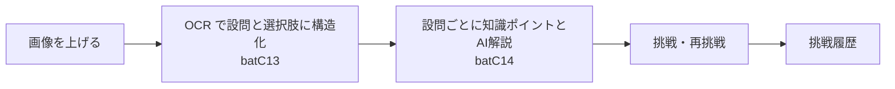

# 英語穴埋め問題 設計（2.1）

> 2.0 の `english_cloze.jsp` ＋ `STY_英語穴埋め問題セット` / `STY_英語穴埋め問題画像` /
> `STY_英語穴埋め問題` / `STY_英語穴埋めOCR履歴` / `STY_英語穴埋め挑戦履歴` を土台に、
> 2.1 の規約（共通列・ファイル実体・子表への分解）で作り直した設計。
> **API・後端・バッチ・画面は未実装**（§7）。DB 定義だけを先に固める。

## 1. 何をする機能か

1. 教材（問題用紙）の**画像を上げる**（2.0 と同じ。既定 10 枚・1 枚 10MB。
   設定 `ENGLISH_CLOZE_MAX_IMAGES` / `ENGLISH_CLOZE_MAX_IMAGE_MB`）。
2. 画像を **OCR して設問と選択肢に構造化する**（2.0 は batC13。同期の画面実行と
   バッチ実行の両方がある）。
3. 設問ごとに**知識ポイントと AI 解説を作る**（2.0 は batC14。日中の 2 言語 ＋ 誤答分析）。
4. 一覧から設問を選んで**挑戦（解答）する**。再挑戦できて、正解・不正解の回数が並ぶ。
5. 過去の解答は**挑戦履歴**として積む（設問の写しを持つ）。

| 項目 | 2.0 / 2.1 の値 |
|---|---|
| 2.0 の画面 | `english_cloze.jsp`（＋ `js/english_cloze.js`。トリミングと画面内ダイアログの学習） |
| 2.1 の画面 | `english-cloze`（一覧）、`english-cloze/new`、`english-cloze/{id}/edit`（登録・編集）、学習は一覧内ダイアログ（直接 URL は `english-cloze/{id}/{questionId}`）。**試作**（`docs/ENGLISH_PRACTICE_DEMO.md`） |
| 設定 | `COM_設定項目` / `COM_設定情報` の `ENGLISH_CLOZE_*`（ページ区分 `ENGLISH_CLOZE`。`database/設定/TBL_COM_設定項目_init.sql` と `TBL_COM_設定情報_init.sql` に投入済み） |
| バッチ | `batC13`（英語穴埋め問題 OCR・構造化）、`batC14`（英語穴埋め問題別AI解説生成）。**`BatchTaskRegistry` に登録済みだが無効**（登録時の有効フラグは false。有効化は運用＝バッチ一覧で行う） |
| 権限 | `docs/PERMISSION_MATRIX.md`: **管 = 問題データ / 子 = 解答 / 親 = 結果の閲覧** |
| 状態 | **試作** |

- AI の呼び出しは `BAT_AI呼出履歴情報` が記録する（プロンプトとレスポンスの本文を持つ）。
- 画像の実体は DB の外（§5）。



## 2. 2.0 との対応

### 2.1 表と 2.0 表（5 表 → 5 表）

| # | 2.0（study2） | 2.1（study21） | 備考 |
|---|---|---|---|
| 1 | `STY_英語穴埋め問題セット` | `ENC_問題セット情報` | `ユーザーID VARCHAR(64)` → `利用者アカウントID`（FK）、`状態 CHAR(1)` → `状態コード VARCHAR(20)`、`登録ID` / `更新ID` → 2.1 の共通列 |
| 2 | `STY_英語穴埋め問題画像` | `ENC_問題画像情報` | `画像データ BYTEA` → 実体はファイル（`相対パス` + `保存ファイル名`）、`原ファイル名` → `原本ファイル名` |
| 3 | `STY_英語穴埋め問題` | `ENC_問題情報` | 選択肢と正解を子表へ、`AI解説`（1 列）を廃止、設問は論理削除 |
| 3' | （無い。`選択肢JSON` の配列） | `ENC_問題選択肢情報` | 2.1 で新設。1 選択肢 = 1 行（`ENC_問題情報` の子） |
| 4 | `STY_英語穴埋めOCR履歴` | **作らない** | `BAT_AI呼出履歴情報` ＋ `BAT_バッチ実行履歴情報` ＋ `ENC_問題情報.AI呼出履歴ID` に分かれる（§2.3） |
| 5 | `STY_英語穴埋め挑戦履歴` | `ENC_挑戦履歴情報` | `ユーザーID` → FK、`回数` を明示の列に、スナップショット列を追加 |

2.0 の 5 表のうち **4 表**（1・2・3・5）がそのまま 2.1 の表へ移り、
`STY_英語穴埋めOCR履歴` だけが表として残らない（§2.3）。
逆に `ENC_問題選択肢情報`（3'）は 2.0 に表が無く、`選択肢JSON` から 2.1 で切り出したもの。


### 列の対応（同じ意味の列）

| 2.0 | 2.1 | 違い |
|---|---|---|
| `状態 CHAR(1)` | `状態コード VARCHAR(20)` | 値（`A` / `X`）は同じ。2.1 の語に合わせた |
| `登録ID` / `更新ID VARCHAR(64)` | `登録者アカウントID` / `更新者アカウントID` ＋ `登録元コード` / `更新元コード` | 人が読む ID 文字列ではなくアカウント ID にする |
| `原ファイル名` | `原本ファイル名` | 英作文（`ENG_英作文画像情報`）の列名に合わせた |
| `選択肢JSON` | `ENC_問題選択肢情報` の行（`選択肢番号` ＋ `選択肢本文`） | 正解も選択肢の一部として検索できる |
| `選択肢翻訳_日本語` / `選択肢翻訳_中国語` | `選択肢訳_日本語` / `選択肢訳_中国語` | 同上 |
| `正解 TEXT` | `正解選択肢番号`（＋選択肢子表の `選択肢本文`） | 正解は 1 か所だけ持つ（本文を二重に持たない） |
| `AI解説` | 廃止（`AI解説_日本語` / `AI解説_中国語` の 2 本だけ） | 日本語と中国語の 2 言語に一本化した |
| `AI解説状態` / `解説AIプロバイダ` / `解説AIモデル` / `解説生成日時` | 同じ列名で残す | 値域も 2.0 と同じ 4 値 |

### 2.2 意図的に変えた点（理由）

1. **選択肢を JSON から子表へ**。2.0 は `選択肢JSON` / `選択肢翻訳_日本語` / `選択肢翻訳_中国語` の
   3 つの JSONB 配列を**添字で**突き合わせていた（ずれると意味が壊れる）。2.1 は
   1 選択肢 = 1 行にして、`UNIQUE (問題ID, 選択肢番号)` で順序を固定する。
   日本語勉強の `JPN_単語問題選択肢情報` と同じ形。
2. **`正解 TEXT` を持たない**。2.0 は正解を文字列でも持ち、`学生答案 = 正解` で判定していた
   （`EnglishClozeRepository`）。2.1 は正解を **`正解選択肢番号`**（`ENC_問題選択肢情報.選択肢番号`）
   だけで表し、正解の本文は子表の `選択肢本文` に 1 か所だけ置く（同じ事実を 2 か所に置かない）。
3. **画像を DB の外へ**。2.0 は `画像データ BYTEA` で 1 枚 10MB まで DB に入れていた。
   2.1 は英作文（`ENG_英作文画像情報`）と同じくファイルに置き、`相対パス` ＋ `保存ファイル名`
   ＋ `ファイルサイズ` を持つ（§5）。DB の大きさとバックアップが実体の量に引きずられない。
4. **設問は論理削除**（`状態コード = 'X'`）。2.0 の「問題を削除」は行を消していたが、
   挑戦履歴が設問を参照しているので、消すと過去の履歴が辿れなくなる。
   `ENC_挑戦履歴情報` はスナップショットを持つが、参照そのものも壊さない。
5. **挑戦の回数を明示の列に**。2.0 は `COUNT(*)` で何回目かを数えていた（同時に解くと重複しうる）。
   2.1 は `回数` を持ち、`UNIQUE (問題ID, 回数)` で固定する。
6. **`AI呼出履歴ID` を足した**。2.0 の `STY_英語穴埋めOCR履歴.応答JSON` は自表で応答を持っていたが、
   2.1 は AI 呼び出しの本文を `BAT_AI呼出履歴情報`（プロンプト／レスポンス）に集める。

### 2.3 OCR 履歴の行き先（2.0 → 2.1）

`STY_英語穴埋めOCR履歴` は**作らない**。持っていた情報は
**`BAT_AI呼出履歴情報`（プロンプト／レスポンス）＋ `BAT_バッチ実行履歴情報`（実行ID）
＋ `ENC_問題情報.AI呼出履歴ID`** の 3 つに分かれる。

| 2.0 `STY_英語穴埋めOCR履歴` の列 | 2.1 での行き先 |
|---|---|
| `実行ID` | `BAT_バッチ実行履歴情報.実行ID`（バッチとして実行した場合。`BAT_AI呼出履歴情報.実行ID` も同じ値を持つ） |
| `OCR履歴ID` | **使わない**（2.1 は OCR 専用の履歴表を持たず、`BAT_AI呼出履歴情報.呼出履歴ID` が担う） |
| `AIプロバイダ` / `AIモデル` / `開始日時` / `終了日時` / `メッセージ` | `BAT_AI呼出履歴情報` の `AI区分` / `モデル名` / `開始日時` / `終了日時` / `エラーメッセージ` |
| `処理状態` | `ENC_問題セット情報.OCR状態`（同じ 4 値。`BAT_AI呼出履歴情報.結果区分` は SUCCESS / FAILURE の別の軸なので使わない） |
| `応答JSON` | `BAT_AI呼出履歴情報.レスポンス`（本文） |
| （送ったプロンプトは持っていなかった） | `BAT_AI呼出履歴情報.プロンプト` |
| `問題セットID` / `画像枚数` | `BAT_AI呼出履歴情報.処理キー`（バッチコード ＋ 処理キーで引く）。**画像枚数は持たない**（`ENC_問題画像情報` を数える） |
| セットの進み具合 | `ENC_問題セット情報.OCR状態` / `AI解説状態` |
| 解説（batC14）の呼び出し | `ENC_問題情報.AI呼出履歴ID`（設問 1 件につき 1 回なので直接指せる） |

- 解説（batC14）は設問 1 件につき 1 回なので、`ENC_問題情報.AI呼出履歴ID` で**直接**指せる。
- OCR（batC13）は 2.0 では**画像 1 枚ごとに並列で**呼んでいた（最大 5）。2.1 の設定済みプロンプトは
  **複数画像をまとめて 1 応答**を受け取る前提なので、まとめて呼ぶ場合は `処理キー` を**セット単位**に
  する（設問側に 1 本の ID は持てないので、`BAT_AI呼出履歴情報` を バッチコード = batC13 ＋ 処理キー
  で引く）。どちらの粒度で呼ぶかは実装時に決める（§7）。
- どちらも FK は張らない（`ENG_AI添削履歴情報.AI呼出履歴ID` と同じ。追記専用のログへの参照）。

## 3. テーブル

### `ENC_問題セット情報`（1 行 = 1 セット = 1 教材）

| 列 | 型 | 意味 |
|---|---|---|
| `問題セットID` | BIGSERIAL PK | |
| `利用者アカウントID` | BIGINT FK→`ACC_アカウント` CASCADE | 教材を持っている利用者（**この人の教材だけが見える**） |
| `出典区分` | VARCHAR(20) CHECK | `EXAM` = 試験過去問 / `PRACTICE` = 練習問題 / `OTHER` = その他 |
| `年度` | INTEGER CHECK | `NULL` か 2000〜2100 |
| `試験練習名` | VARCHAR(200) NOT NULL | 試験名・練習帳の名前（一覧と検索に出す） |
| `章節` | VARCHAR(200) NULL | 章・節 |
| `備考` / `問題概要` / `知識ポイント` | TEXT | 人が書く覚え書き／概要／知識ポイント |
| `OCR状態` | VARCHAR(20) CHECK | `WAITING` / `RUNNING` / `COMPLETED` / `ERROR`（batC13） |
| `AI解説状態` | VARCHAR(20) CHECK | 同じ 4 値（batC14） |
| `状態コード` | VARCHAR(20) CHECK | `A` = 有効 / `X` = 削除（論理削除） |
| 共通列（**7 列**） | | `バージョン` / `登録者アカウントID` / `更新者アカウントID` / `登録元コード` / `更新元コード` / `登録日時` / `更新日時`。**利用者が持つ本体**なので版管理を持つ（`ENG_英作文情報` と同じ型） |

索引: `(利用者アカウントID, 登録日時 DESC, 問題セットID DESC) WHERE 状態コード='A'`（一覧）、
`(利用者アカウントID, 出典区分, 年度) WHERE 状態コード='A'`（絞り込み）。

### `ENC_問題画像情報`（1 行 = 1 枚。実体はファイル）

`問題画像ID` PK／`問題セットID` FK CASCADE／`表示順` CHECK(>=1)（`UK_ENC_問題画像_順 UNIQUE (問題セットID, 表示順)`）／
`原本ファイル名` VARCHAR(300) NULL／`保存ファイル名` VARCHAR(200) NOT NULL／`相対パス` VARCHAR(500) NOT NULL／
`MIMEタイプ` VARCHAR(120) NOT NULL／`ファイルサイズ` BIGINT CHECK(>=0) NOT NULL DEFAULT 0／
`登録者アカウントID`／`登録日時`。

子表の共通列は **`登録者アカウントID` と `登録日時` の 2 列**（`ENG_英作文画像情報` と同じ）。

### `ENC_問題情報`（1 行 = 1 設問）

| 列 | 型 | 意味 |
|---|---|---|
| `問題ID` | BIGSERIAL PK | |
| `問題セットID` | BIGINT FK CASCADE | `UK_ENC_問題_番号 UNIQUE (問題セットID, 問題番号)` |
| `問題画像ID` | BIGINT FK→画像 **SET NULL** | どの紙面から取ったか（紙面を消しても設問は残す） |
| `問題番号` | INTEGER CHECK(>=1) NOT NULL | 教材の中の設問番号（1 から） |
| `画像内順序` | INTEGER CHECK(>=1) NULL | 紙面の中での並び |
| `問題文` | TEXT NOT NULL | 空所を含む設問の本文（OCR を人が直したもの） |
| `問題翻訳_日本語` / `問題翻訳_中国語` | TEXT | 設問の和訳 |
| `完成問題文` | TEXT | 正解を補った文（2.0 の 023 の列） |
| `学生答案` / `赤字訂正答案` | TEXT | 紙面の答案／赤字の訂正。**`学生答案` は最新の 1 回の写し**（一覧表示用。正は `ENC_挑戦履歴情報`。再挑戦のたびに上書きする） |
| `正解選択肢番号` | INTEGER CHECK(>=1) NULL | **正解**（`ENC_問題選択肢情報.選択肢番号`） |
| `正解決定根拠` | VARCHAR(40) CHECK | `RED_CORRECTION` / `UNCORRECTED_STUDENT_ANSWER` / `UNKNOWN` |
| `回答判定` | VARCHAR(16) CHECK | `CORRECT` / `INCORRECT` / `UNANSWERED` / `UNKNOWN`。**最新の 1 回の判定**（一覧表示用。正は `ENC_挑戦履歴情報`） |
| `OCR信頼度` | NUMERIC(6,5) CHECK(0〜1) | 2.0 と同じ精度 |
| `知識ポイント` | TEXT | この設問の知識ポイント（batC14） |
| `AI解説_日本語` / `AI解説_中国語` | TEXT | AI 解説（**2.0 の `AI解説` 1 列は持たない**） |
| `学生誤答分析_日本語` / `学生誤答分析_中国語` | TEXT | 誤答の分析（2.0 の 023 の列） |
| `AI解説構造化JSON` / `OCR構造化JSON` | JSONB NOT NULL DEFAULT `'{}'::jsonb` CHECK(object) | 各バッチの構造化応答（2.0 の 022 / 023 の列） |
| `AI解説状態` | VARCHAR(20) CHECK | `WAITING` / `RUNNING` / `COMPLETED` / `ERROR` |
| `解説AIプロバイダ` / `解説AIモデル` / `解説生成日時` | VARCHAR(40) / VARCHAR(120) / TIMESTAMP | どの AI がいつ作ったか |
| `AI呼出履歴ID` | BIGINT NULL | 解説（batC14）の `BAT_AI呼出履歴情報.呼出履歴ID`。FK は張らない |
| `状態コード` | VARCHAR(20) CHECK | `A` = 有効 / `X` = 削除（**論理削除**＝挑戦履歴の参照を壊さない） |
| 共通列（**6 列**） | | `登録者アカウントID` / `更新者アカウントID` / `登録元コード` / `更新元コード` / `登録日時` / `更新日時`。設問は子なので **`バージョン` を持たない**（`バージョン` は楽観ロックの実装と対で意味を持つので親だけが持つ。`JPN_単語問題情報` と同じ型） |

索引: `(問題画像ID) WHERE 問題画像ID IS NOT NULL`、`(回答判定)`、`(正解決定根拠)`、
`(問題セットID, 問題番号) WHERE 状態コード='A'`。

### `ENC_問題選択肢情報`（1 行 = 1 選択肢。2.0 の `選択肢JSON` の置き換え）

`選択肢ID` PK／`問題ID` FK CASCADE／`選択肢番号` INTEGER CHECK(1〜6)（`UK_ENC_選択肢_番号 UNIQUE (問題ID, 選択肢番号)`）／
`選択肢本文` TEXT NOT NULL CHECK(空文字でない)／`選択肢訳_日本語`／`選択肢訳_中国語`／
`補足_日本語`／`補足_中国語`／
共通列（**2 列**）: `登録者アカウントID` / `登録日時`（`ENG_英作文画像情報` と同じ子の型）。

索引: 張らない（`UK_ENC_選択肢_番号 UNIQUE (問題ID, 選択肢番号)` で足りる）。
正解は `ENC_問題情報.正解選択肢番号` が持つので、この表に `正解フラグ` は置かない
（同じ事実を 2 か所に置かない）。

**`選択肢番号` の上限は 1〜6**。2.0 の OCR が返す選択肢は 1 問 4 択
（`english_cloze.js` の見本データも 4 択）だが、設問によって 3 択・5 択がありうるので
4 で固定せず、明らかな誤り（0 や 7 以上）だけを弾く。

### `ENC_挑戦履歴情報`（1 行 = 1 回の解答。スナップショット付き）

| 列 | 意味 |
|---|---|
| `挑戦履歴ID` | BIGSERIAL PK |
| `問題ID` / `回数` | `UK_ENC_挑戦履歴_回 UNIQUE (問題ID, 回数)`。画面はこの回数で並べる |
| `利用者アカウントID` | FK→`ACC_アカウント` CASCADE。教材は利用者ごとだが、2.0 と同じく列として持ち検索に使う |
| `選択答案` | 選んだ答案（選択肢の記号、または本文） |
| `判定` | `CORRECT` / `INCORRECT` |
| `問題文` | **写し**（NOT NULL） |
| `選択肢JSON` | **写し**（2.0 の `選択肢JSON` と同じ形の配列。CHECK(array)） |
| `正解選択肢番号` / `解説_日本語` / `解説_中国語` | **写し**（NULL 可） |
| `回答日時` | NOT NULL DEFAULT CURRENT_TIMESTAMP |
| 共通列 | **2 列**（`登録者アカウントID` / `登録日時`）。**履歴は追記のみ**なので版管理も更新の監査も持たない（`ENG_AI添削履歴情報` と同じ型。2.0 からの移行分は 挑戦履歴ID の範囲と 回答日時 で見分ける） |

索引: `(利用者アカウントID, 回答日時 DESC)`。設問ごとの履歴は `UK_ENC_挑戦履歴_回` で引ける。

## 4. 関係

```
ACC_アカウント 1 ─── n ENC_問題セット情報 1 ─── n ENC_問題画像情報
                                      └──── n ENC_問題情報 1 ─── n ENC_問題選択肢情報
                                                    └──── n ENC_挑戦履歴情報 n ─── 1 ACC_アカウント
ENC_問題情報.問題画像ID ── 0..1 ──> ENC_問題画像情報   （ON DELETE SET NULL）
```

- 教材を消す（`ENC_問題セット情報` の行を物理削除）と、紙面・設問・選択肢・挑戦履歴は
  すべて CASCADE で消える。**通常の削除は `状態コード = 'X'`**（論理削除）。
- 設問の論理削除（`ENC_問題情報.状態コード = 'X'`）は挑戦履歴に影響しない（履歴側に写しを持つ）。

## 5. 画像の実体

- 置き場: `<study21.english-cloze.storage-root>/english-cloze/{アカウントID}/{yyyyMM}/{uuid}.{ext}`
  （`相対パス` はこの規約の途中まで。**パスの遍歴（`..`）は弾く**）
  - 根（`storage-root`）は `english-cloze/` の**親**を指す（`相対パス` 側が `english-cloze/…` で
    始まるため）。英作文と同じく `STUDY21_ENGLISH_CLOZE_STORAGE_ROOT=/app/data` とする。
  - **compose は未対応**。`docker-compose.yml` には `STUDY21_ENGLISH_ESSAY_STORAGE_ROOT` と
    ボリューム `files/english-essay → /app/data/english-essay` はあるが、
    `english-cloze` の環境変数とボリュームはまだ無い（§7 の今後の作業）。
- 上限: 設定 `ENGLISH_CLOZE_MAX_IMAGES`（既定 10）・`ENGLISH_CLOZE_MAX_IMAGE_MB`（既定 10）
- 注意: 実体はファイルなので、**環境（ホスト）ごとに置く必要がある**。
  2.0 から移行するときは `画像データ BYTEA` を書き出してから `相対パス` を入れる（§6）。

## 6. 移行の方針

**移行 SQL（`MIG_*.sql`）はまだ作らない。** 作るときの方針だけ決めておく。

- 移行元は **study2**（`STY_英語穴埋め問題セット` / `STY_英語穴埋め問題画像` /
  `STY_英語穴埋め問題` / `STY_英語穴埋め挑戦履歴`）。study2 は study21 と**同じ PostgreSQL
  インスタンス**に同居しているので、既存の `database/移行/MIG_*.sql` と同じく
  `dblink('dbname=study2', …)` で読む（`MIG_ENG_英作文_2.0から移行_20260927.sql` と同じやり方）。
- 何度流しても同じにする（`NOT EXISTS` / `ON CONFLICT`）。移行した行は `登録元コード = 'MIGRATION'`
  にする（**`登録元コード` を持つのは セット と 設問 だけ**。画像・選択肢・挑戦履歴は子・履歴の型で
  登録者アカウントID と 登録日時 の 2 列しか持たないので、移行分は ID の範囲と日時で見分ける）。
- ID はそのまま使う（追跡のため）。移行後にシーケンスを進める。

注意点:

1. **列名の対応**: `原ファイル名` → `原本ファイル名`、`状態` → `状態コード`、
   `登録ID` / `更新ID` → アカウント列 ＋ コード列。
2. **`画像データ BYTEA` はファイルへ書き出してから** `相対パス` / `保存ファイル名` /
   `ファイルサイズ` を入れる。SQL だけでは完結しない（英作文の
   `deploy/copy-essay-images.sh` に相当する書き出しが要る）。
3. **`ユーザーID VARCHAR(64)` → アカウントID の対応表が要る**。英作文の移行と同じく
   `'liu'` → アカウント 1、`'ljz'` → アカウント 2（`MIG_JPN_日本語勉強_20260913.sql` と同じ対応）。
   **対応の無い `ユーザーID` があれば `NOTICE` で知らせる**（黙って落とさない）。
4. **挑戦履歴の回数は回答日時の順で採番**する（2.0 は回数の列が無い）。
   `問題ID` ごとに `row_number() OVER (PARTITION BY "問題ID" ORDER BY "回答日時", "挑戦履歴ID")`。
5. **`正解 TEXT` → `正解選択肢番号`** は、`選択肢JSON` の各要素の本文（または
   `optionLabel` に相当する記号）と `正解` を突き合わせて決める。一致しない行は
   `正解選択肢番号 = NULL` / `正解決定根拠 = 'UNKNOWN'` にして**人が直せるように残す**
   （勝手に正解を決めない）。
6. **`選択肢JSON` / `選択肢翻訳_日本語` / `選択肢翻訳_中国語` は添字で突き合わせる**
   （配列の長さが違う行がありうる。足りない分は NULL）。
7. `STY_英語穴埋めOCR履歴` は移行しない（§2.3）。

## 7. 今後の課題

1. **API が未実装**（user-api / admin-api とも）。一覧・詳細・登録・更新・削除・画像の取得・
   挑戦（解答）と履歴のエンドポイントが要る。
2. **後端が未実装**。MyBatis の Mapper・サービス・権限の確認（所有者、親＝結果の閲覧）が要る。
3. **バッチが未実装**。`batC13`（OCR・構造化）と `batC14`（問題別 AI 解説）は
   `BatchTaskRegistry` に**登録済みだが無効**。Step の実装と、
   `BAT_AI呼出履歴情報` への記録（プロンプト・レスポンス・実行ID）が要る。
4. **画面が試作**（`english-cloze` は 2.0 の見た目をなぞった段階）。
5. **画像のストレージ配備が未対応**。`docker-compose.yml` に
   `STUDY21_ENGLISH_CLOZE_STORAGE_ROOT` とボリューム `files/english-cloze` を足す。
6. **移行 SQL と画像の書き出し**（§6）が未着手。
7. **見本データ**（`SAMPLE_ENC_*.sql`）は未作成。画像は実体がファイルなので、
   英作文と同じく**画像を持たない見本**にするのが素直。
8. **家族スコープ**: 「親＝結果の閲覧」は未実装（家族の関係を引く必要がある。
   英作文と同じ課題）。
