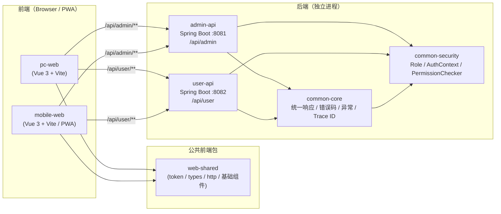

# 总体架构

## 1. 概述

Study 2.1 是一个独立代码仓库，包含四个可独立构建、独立部署的应用：

1. `pc-web`（PC 前端）
2. `mobile-web`（Mobile 前端 / PWA）… 骨組みのみ（業務画面は後で追加）
3. `admin-api`（管理员后端）
4. `user-api`（普通用户后端，供学生与家长使用）

前端与后端通过 HTTP 交互。两个后端是独立运行的服务，互不调用。

## 2. Mermaid 架构图

## 3. PC / Mobile / admin-api / user-api 关系

- PC 与 Mobile 是两个独立前端应用，通过 `web-shared` 复用：
  - Design Token
  - TypeScript 类型
  - HTTP 基础工具
  - API 统一响应类型
  - 无业务含义的基础组件
- 两个前端都以相同方式调用两个后端：
  - 开发环境：Vite 代理 `/api/admin` → `http://localhost:8081`、`/api/user` → `http://localhost:8082`
  - 生产环境：同域反向代理 `/api/admin/**` → admin-api、`/api/user/**` → user-api
- `admin-api` 与 `user-api` 互不调用（禁止互相依赖）。

## 4. 两个后端的边界

| 维度 | admin-api | user-api |
|---|---|---|
| 前缀 | `/api/admin` | `/api/user` |
| 端口 | 8081 | 8082 |
| 服务对象 | 管理员 | 学生 / 家长 |
| 本阶段端点 | `/api/admin/health`、`/api/admin/system/info`、`/actuator/health` | `/api/user/health`、`/api/user/system/info`、`/actuator/health` |
| 安全策略 | health / system/info 匿名，其余默认拒绝 | health / system/info 匿名，其余默认拒绝 |

两个后端使用**不同的安全配置**，但共享 `common-security` 的抽象与工具。

## 5. 不依赖旧系统的原则

- 旧系统目录只读分析，绝不修改。
- 不复制旧系统业务代码。
- 不依赖旧系统数据库。
- 构建产物输出到本仓库，绝不输出到旧系统目录。
- 旧系统仅作为未来“功能迁移”的参考来源（见 `MIGRATION_STRATEGY.md`）。
